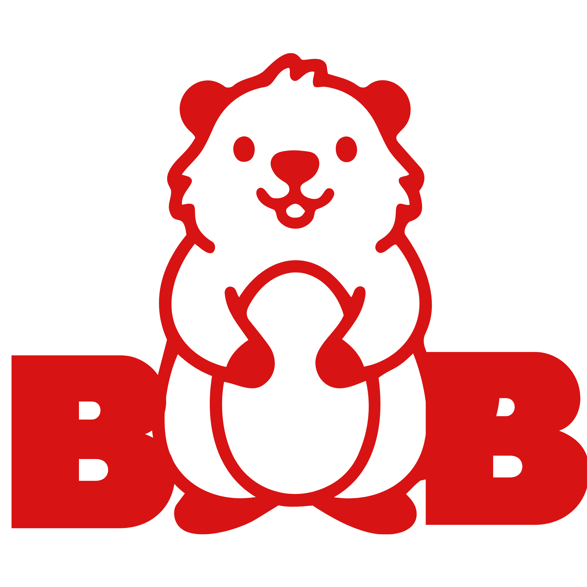
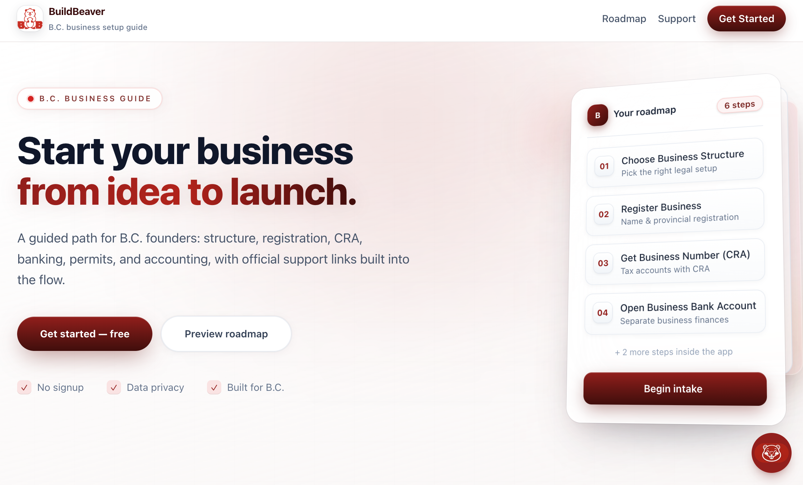
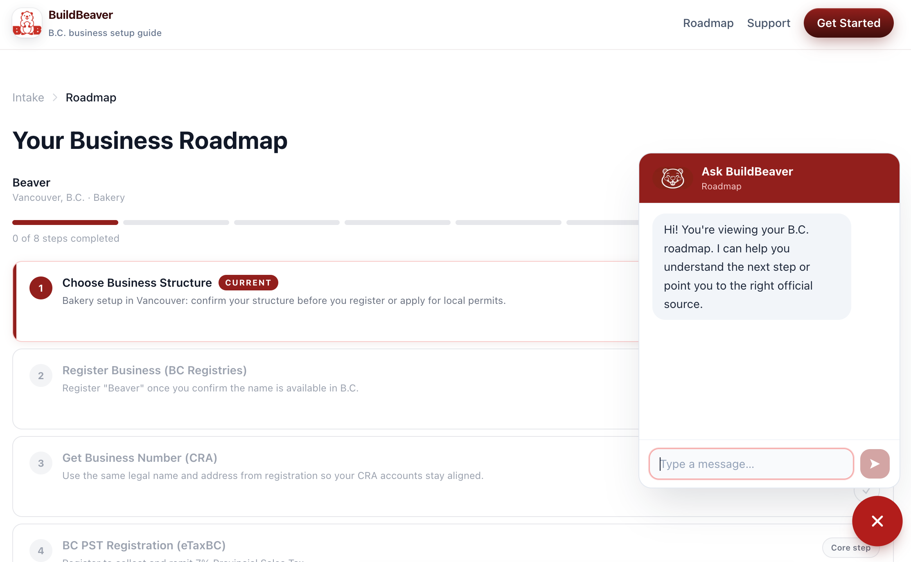
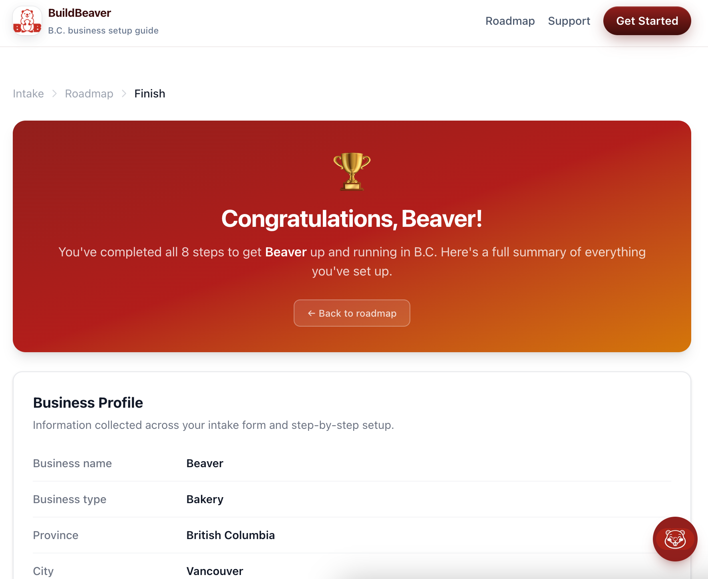

<div align="center">
  
  <h1>BuildBeaver</h1>
  <p>A guided web app that helps users start a business in British Columbia.</p>
</div>

---

## Screenshots

| Landing                           | Roadmap                           | Finish                           |
| --------------------------------- | --------------------------------- | -------------------------------- |
|  |  |  |

## The Problem

Starting a business in B.C. means navigating dozens of disconnected government websites, forms, and agencies — BC Registries, CRA, eTaxBC, WorkSafeBC, municipal licensing, and more. It's easy to miss a step, hit the wrong portal, or waste hours figuring out what even applies to your situation.

BuildBeaver puts it all in one place: a single guided flow that knows your business type and location, filters out irrelevant steps, and hands you the right links and prefilled form content at each stage.

## The Problem

Starting a business in B.C. means navigating dozens of disconnected government websites, forms, and agencies — BC Registries, CRA, eTaxBC, WorkSafeBC, and local permit offices, to name a few. There's no single place that tells you what to do, in what order, or what information you'll need.

BuildBeaver solves this by bringing everything into one guided flow: the right steps, the right links, and an AI assistant to answer questions along the way.

## Overview

BuildBeaver walks users through an 8-step business setup roadmap, providing clear guidance and copy-ready form outputs for each registration step. No signup required — data stays in the browser.

## User Flow

1. **Landing** — Brief intro and "Get Started" prompt
2. **Intake** — User enters business type, location, and name
3. **Roadmap** — Checklist overview of all 8 steps with progress tracking
4. **Step Pages** — Detailed guidance per step, with an interactive Form Assistant on registration steps
5. **Finish** — Congratulations summary with full business profile

## Steps

| #   | Step                              | Type                    |
| --- | --------------------------------- | ----------------------- |
| 1   | Choose Business Structure         | Form Assistant          |
| 2   | Register Business (BC Registries) | Form Assistant          |
| 3   | Get Business Number (CRA)         | Form Assistant          |
| 4   | BC PST Registration (eTaxBC)      | Informational           |
| 5   | WorkSafeBC                        | Informational           |
| 6   | Open Business Bank Account        | Informational           |
| 7   | Licenses & Permits                | Checklist (AI-filtered) |
| 8   | Basic Accounting Setup            | Informational           |

## Key Features

- **Form Assistant** — Prefills fields using intake data, generates structured copy-ready output
- **Ask BuildBeaver** — Gemini-powered chat assistant available throughout the roadmap
- **AI Permit Filtering** — Licenses & Permits step uses Gemini to surface relevant permits by business type and location
- **No database or auth** — All state lives in React context; nothing is stored server-side

## Tech Stack

- **Next.js** (App Router, TypeScript)
- **Tailwind CSS**
- **Gemini API** — AI chat and permit filtering

## Getting Started

```bash
npm install
npm run dev
```

Open [http://localhost:3000](http://localhost:3000) to view the app.

Optionally, add a `GEMINI_API_KEY` to `.env.local` to enable live AI features. Without it, the app falls back to a manual prompt-copy workflow via `gemini-stub/`.

## Hackathon

Built at the **Cursor Hackathon — Vancouver, 22 March 2026**.

Contributors: [@vedudx](https://github.com/vedudx) · [@idaknow](https://github.com/idaknow) · [@summer-youth](https://github.com/summer-youth) · [@eunmibean](https://github.com/eunmibean) · [@stephanwehner](https://github.com/stephanwehner)
